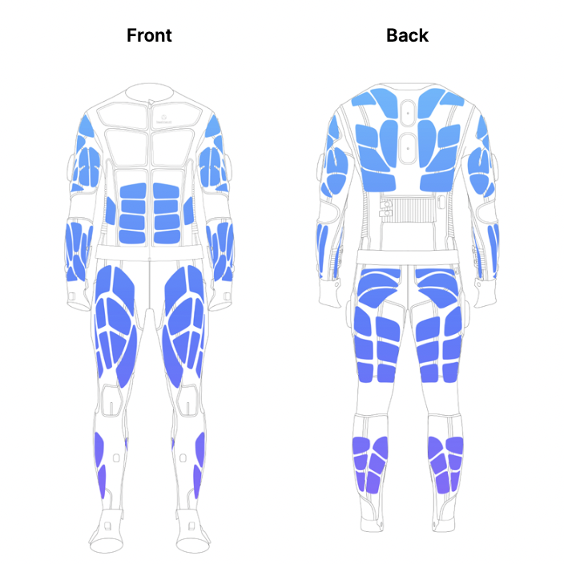
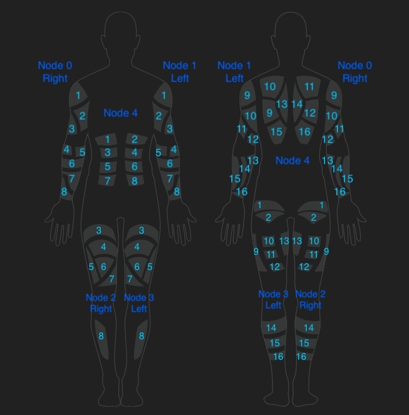

## Quick access
- [Haptic Subsystem](../API%20Reference/subsystems/haptic.qmd)
- [Examples](../examples/haptic_example.qmd)
- [Haptic Data structures](../API%20Reference/core/data_structures.qmd#haptic)

## What is haptic feedback?

Haptic feedback refers to the use of tactile sensations to communicate information to the user through touch. In wearable technology, haptic feedback is typically delivered via electrical stimulation, vibration, or temperature changes, allowing users to feel virtual objects, receive notifications, or experience immersive effects in virtual environments.

Haptic technology is widely used in gaming, VR/AR, rehabilitation, and training applications to enhance realism and interactivity. By stimulating the skin and muscles, haptic feedback can simulate textures, impacts, or environmental cues, providing a richer and more engaging user experience.

## Haptic in Teslasuit

The Teslasuit integrates advanced haptic feedback technology, enabling precise and programmable tactile sensations across the body. The haptic subsystem in the Teslasuit allows developers to create, manage, and play haptic effects, including instant touches and looped playables, using a flexible API.

The Teslasuit's haptic functionality is accessible through the [`TsHapticPlayer`](../API%20Reference/subsystems/haptic.qmd) class, which provides methods for creating haptic effects, controlling playback, and customizing parameters such as amplitude, period, and pulse width. The haptic subsystem is tightly integrated with the Teslasuit API, allowing seamless incorporation of tactile feedback into applications.

Haptic feedback electrodes are located as shown on the picture below:



## Key features of the Teslasuit haptic subsystem

1. **Programmable Haptic Effects**: Developers can create custom haptic effects by specifying parameters such as amplitude, period, and pulse width, or by using pre-defined haptic assets.
2. **Instant Touches and Playables**: The subsystem supports both instant haptic touches (short, parameterized effects) and playables (longer, asset-based effects that can be looped or sequenced).
3. **Channel Mapping**: Haptic feedback can be targeted to specific body areas or channels, enabling localized sensations and complex patterns.
4. **Real-Time Control**: The API allows real-time control over haptic playback, including pausing, muting, and adjusting multipliers for global effect scaling.

## How the Teslasuit API implements haptic feedback

The Teslasuit API provides a structured approach to accessing and utilizing haptic feedback. Below are the key steps involved:

1. **Initialization**: The Teslasuit API must be initialized before accessing the haptic subsystem.
2. **Device Connection**: A Teslasuit device must be connected to access its haptic subsystem.
3. **Subsystem Access**: The haptic subsystem is accessed through the `haptic` property of the connected device, returning an instance of the [`TsHapticPlayer`](../API%20Reference/subsystems/haptic.qmd) class.
4. **Effect Creation and Playback**: The [`TsHapticPlayer`](../API%20Reference/subsystems/haptic.qmd) class provides methods to create haptic effects, play or stop them, and adjust parameters in real time.

## Description of haptic data

Below is a detailed description of the haptic data and data structures used in the Teslasuit API for the haptic subsystem.

### Haptic parameters

#### What are haptic parameters?

Haptic parameters define the characteristics of a haptic effect, such as how strong it feels, how long it lasts, and what pattern it follows. The main parameters include:

- **Period**: The duration of one cycle of the haptic signal, in microseconds (µs). It is inversely proportional to frequency — a shorter period corresponds to a higher frequency.
- **Amplitude**: The strength or intensity of the haptic effect.
- **Pulse Width**: The duration of each pulse within a period, affecting the sharpness of the sensation.

#### Why haptic parameters matter

By adjusting these parameters, developers can create a wide range of tactile sensations, from gentle vibrations to sharp pulses or even temperature changes. This flexibility allows for realistic simulation of touch, impact, or environmental effects.

#### Haptic parameters in Teslasuit

Teslasuit exposes haptic parameters through the [`TsHapticParam`](../API%20Reference/core/data_structures.qmd#tshapticparamstructure) structure. Parameters can be grouped and passed to the haptic player to define instant touches or modify playables.

 Main haptic parameters are:

1. **Amplitude**: Controls the strength or intensity of the haptic effect. Higher amplitude results in a stronger sensation. Amplitude is a value in percent, where 1% is the minimal value in Control Center calibration and 100% is maximal.
2. **Period**: Specifies the duration of a single cycle of the haptic signal, measured in **microseconds (µs)**. The period is inversely proportional to frequency and is calculated using the formula: `period (µs) = 1000000 / frequency (Hz)`. The supported frequency range is from 1 Hz to 150 Hz, corresponding to periods of 1,000,000 µs down to ~6,667 µs.
3. **Pulse Width**: Specifies the duration of each pulse within a period, influencing the sharpness or smoothness of the sensation.
4. **Duration**: Touch-specific parameter to set a precise duration (in milliseconds) for an instant haptic touch. This allows developers to control how long the sensation lasts, independent of the underlying signal period or amplitude.

These parameters can be combined and adjusted to create a wide variety of tactile effects tailored to specific application needs.

### Haptic playables

- **Asset**: A pre-designed haptic pattern created using the Haptic Editor, typically stored in the `.ts_asset` format.

::: {.callout-tip collapse="true"}
## Hint
To create playble from the file with format `.ts_asset` you need:

1. **Load asset**  
   - Load asset from path using `load_asset_from_path` function from [`Asset manager`](../API%20Reference/core/asset_manager.qmd).  

2. **Create playable**  
   - pass the object from step 1 to `create playable` function from [`Haptic subsystem`](../API%20Reference/subsystems/haptic.qmd):

:::

- **Touch**: An instant, parameterized haptic effect designed for short, targeted stimulation.
- **Playable**: Any haptic effect, either an asset or a touch, that is prepared and ready for playback.

 ```{mermaid}
flowchart TD
    A([Touch]) --> B[[Playable]]
    C([Asset]) --> B
 
```

### Haptic multipliers

#### Master multiplier

Master multiplier changes affect all playable items. There can be numerous
multipliers, each corresponding to a specific haptic parameter type (such as amplitude, period, or pulse width). This allows you to globally adjust the intensity or characteristics of all haptic effects at once by modifying the relevant multiplier. For example, increasing the amplitude multiplier will make all haptic sensations stronger, while adjusting the period multiplier can change the frequency of all effects system-wide.

#### Playable multiplier

Playable multiplier affects a specific playable item, allowing fine-tuned control over its haptic parameters independently of the global (master) settings. There can be multiple multipliers, each corresponding to a different haptic parameter type (such as amplitude, period, or pulse width) for a given playable. This enables developers to dynamically adjust the intensity or characteristics of individual haptic effects during playback without altering the overall system behavior.

#### Touch multiplier

Touch multipliers allow you to adjust the intensity or characteristics of individual instant touches. By applying a multiplier to a touch, you can control parameters such as amplitude, period, or pulse width for that specific effect, without affecting other touches or playables. This enables precise, real-time customization of haptic sensations for each instant touch event.

## Applications of haptic feedback in Teslasuit

The haptic subsystem in the Teslasuit has a wide range of applications, including:

- **Immersive VR/AR**: Simulate touch, impact, or environmental effects for enhanced immersion.
- **Training and Simulation**: Provide realistic feedback for muscle memory and skill acquisition.
- **Rehabilitation**: Deliver targeted stimulation for therapy and recovery.
- **Gaming**: Enhance gameplay with tactile cues and effects.

## Scheme of correspondence of nodes and channels for haptic

The Teslasuit haptic subsystem organises stimulation points using a hierarchy of nodes and channels:

- **Node**: Unit which controls channels throughout the body region (e.g right arm).
- **Channel**: Group of electrodes connected to one channel in the node.

### Mapping haptic effects to channels

Haptic effects can be mapped to specific channels or groups of channels within the Teslasuit. This allows developers to target tactile sensations to precise areas of the body, enhancing realism and control. Channel mapping can be defined either within a haptic asset or when creating haptic effects programmatically, ensuring the effect is delivered to the intended location.

> **Note:** When working with predefined haptic assets (such as `.ts_asset` files), channel mapping is fixed within the asset and cannot be changed programmatically. If you prefer to define haptic touches in your code, rather than use haptic assets, please use the scheme below to target channels correctly. This approach helps avoid unexpected sensations and ensures that stimulation is applied only to the desired channels.

#### Correspondence scheme



This structure enables developers to deliver localised or distributed haptic effects by specifying the appropriate area or channel in their code.

The "Bone" is an abstraction representing body part (e.g. Upper arm), and the corresponding [Bone indexes](../API%20Reference/core/data_structures.qmd#tsbone2dindexintenum) to different body parts are described in the Data Structures description.


| Body area       | Bone index         | Channel on mapping scheme     | Bone channel ID        |
|:--------------- |:-------------------|:------------------------------|:-----------------------|
| Left Upper arm front | 12            | 1,2,3                         | 0, 1, 2                |
| Right Upper arm front | 14           | 1,2,3                         | 0, 1, 2                |
| Left Upper arm back | 13             | 9, 10, 11,12                  | 0, 1, 2, 3             |
| Right Upper arm back | 15            | 9, 10, 11,12                  | 0, 1, 2, 3             |
| Left lower arm front | 16            | 4, 5, 6, 7, 8                 | 0, 1, 2, 3, 4          |
| Right lower arm front | 18           | 4, 5, 6, 7, 8                 | 0, 1, 2, 3, 4          |
| Left lower arm back | 17             | 13, 14, 15, 16                | 0, 1, 2, 3             |
| Right lower arm back | 19            | 13, 14, 15, 16                | 0, 1, 2, 3             |
| Abdomen         | 8                  | 1, 2, 3, 4, 5, 6, 7, 8        | 0, 1, 2, 3, 4, 5, 6, 7 | 
| Back            | 11                 | 9, 10, 11, 12, 13, 14, 15, 16 | 0, 1, 2, 3, 4, 5, 6, 7 | 
| Left Upper leg front | 0             | 3, 4, 5, 6, 7                 | 0, 1, 2, 3, 4          | 
| Right Upper leg front | 2            | 3, 4, 5, 6, 7                 | 0, 1, 2, 3, 4          | 
| Left Upper leg back | 1              | 1, 2, 9, 10, 11, 12, 13       | 0, 1, 2, 3, 4, 5, 6    | 
| Right Upper leg back | 3             | 1, 2, 9, 10, 11, 12, 13       | 0, 1, 2, 3, 4, 5, 6    | 
| Left Lower leg front | 4             | 8                             | 0                      | 
| Right Lower leg front | 6            | 8                             | 0                      | 
| Left Lower leg back | 5              | 14, 15, 16                    | 0, 1, 2                | 
| Right Lower leg back | 7             | 14, 15, 16                    | 0, 1, 2                | 

::: {.callout-tip collapse="false"}

   To select the correct haptic channel in your code, follow these steps:

   1. **Refer to the mapping scheme**  
      - Locate the desired channel number on the mapping scheme above.

   2. **Consult the table**  
      - Use the table to find the corresponding bone index for the target body area and the bone channel ID for the channel.

   3. **Use the correct Python code**
      - See the example below for selecting channel 14 on the left arm:

   ```python
      # Initialize device 
      # ...
      # Retrieve the haptic channel layout. Do this once and reuse the layout object.
      layout = mapper.get_haptic_electric_channel_layout(device.get_mapping())
      # Retrieve the bones structure. Also do this once and reuse.
      bones = mapper.get_layout_bones(layout)
      # According to the mapping scheme, channel 14 on the left lower arm (back) 
      # corresponds to bone index 17 and bone channel ID 1.
      channel = mapper.get_bone_contents(bones[17][1])
   ```
:::

## Dependencies in data structures and accessing data

The Teslasuit haptic subsystem relies on a hierarchy of data structures to manage and process haptic effects. Below is a description of the dependencies between these structures and a block scheme illustrating how data is accessed.

### Data structure dependencies

1. [`TsHapticParam`](../API%20Reference/core/data_structures.qmd#tshapticparamstructure):
   - Represents a single haptic parameter (type and value).
2. [`TsHapticParamMultiplier`](../API%20Reference/core/data_structures.qmd#tshapticparammultiplierstructure):
   - Represents a multiplier for a haptic parameter.
3. [`TsHapticParamType`](../API%20Reference/core/data_structures.qmd#tshapticparamtypeenum):
   - Manages haptic playables, touches, and playback state.


### Block scheme for accessing data

Below is a simplified block scheme illustrating the flow of data from parameter creation to playback:

```{mermaid}
flowchart TD
    A([TsHapticPlayer]) --> B[[TsHapticParam]]
    A --> C[[TsHapticParamMultiplier]]
    B --> D((type))
    B --> E((value))
    C --> F((type))
    C --> G((value))
```

## Example code

For detailed examples of how to use the haptic subsystem in the Teslasuit API, refer to the [Haptic Examples](../examples/haptic_example.qmd) page. These examples demonstrate how to initialize the API, connect to a device, and play haptic effects.

## Conclusion

The haptic subsystem in the Teslasuit provides a powerful and flexible platform for delivering tactile feedback. By leveraging the Teslasuit API, developers can create immersive, interactive, and responsive experiences across a wide range of applications.

