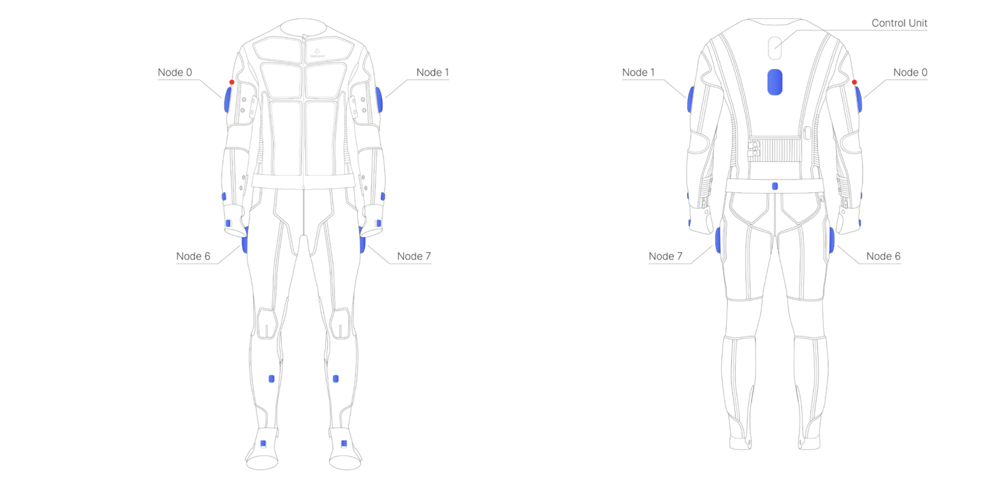

## Quick access
- [Mocap Subsystem](../API%20Reference/subsystems/mocap.qmd)
- [Examples](../examples/mocap_example.qmd)
- [Use case](../usecases/index.qmd)
- [Mocap Data structures](../API%20Reference/core/data_structures.qmd#mocap)

## What is Mocap?

Motion capture (Mocap) is a technology used to record the movement of objects or people. It is widely used in fields such as animation, gaming, sports, and biomechanics to analyze and replicate motion. Mocap systems track the position and orientation of key points on a subject and translate them into digital data.

Motion capture (Mocap) is a foundational technology in wearable devices, allowing for real-time monitoring of body movements. It serves a wide array of purposes, from entertainment to healthcare, making it a highly adaptable tool for motion analysis and simulation.

## Mocap in Teslasuit

Teslasuit integrates Mocap technology as part of its motion capture subsystem, enabling advanced motion tracking capabilities. The Mocap subsystem in the Teslasuit is designed to provide real-time data on skeletal positions, orientations, and biomechanical angles. This data can be used for various applications, including animation, rehabilitation, and sports performance analysis.

System relies on 14 strategically placed inertial measurement unit (IMU) sensors embedded throughout the suit. These sensors ensure high-resolution tracking of body movements, delivering precise and consistent motion data across all major joints and body segments.

The Teslasuit's Mocap functionality is accessible through the [`TsMocap`](../API%20Reference/subsystems/mocap.qmd) class, which provides methods for streaming raw data, retrieving skeleton data, and performing calibration. The Mocap subsystem is tightly integrated with the Teslasuit API, allowing developers to seamlessly incorporate motion data into their applications.

Mocap sensors are located as shown on the picture below:



## Key features of the Teslasuit Mocap subsystem

1. **Raw Data Streaming**: The Teslasuit Mocap subsystem allows developers to stream raw motion data in real time. This data can be used for custom analysis and visualization.
2. **Skeleton Data**: The subsystem provides detailed skeletal data, including bone positions and orientations, enabling precise motion tracking.
3. **Biomechanical Angles**: The subsystem offers biomechanical angle data, which is useful for analyzing joint movements and posture.
4. **Calibration**: The Mocap subsystem includes a calibration feature to ensure accurate motion tracking.

## How the Teslasuit API implements Mocap

The Teslasuit API provides a structured approach to accessing and utilizing Mocap data. Below are the key steps involved:

1. **Initialization**: The Teslasuit API must be initialized before accessing the Mocap subsystem. This ensures that the API is ready to communicate with the Teslasuit device.
2. **Device Connection**: A Teslasuit device must be connected to access its Mocap subsystem. The API provides methods to wait for and retrieve connected devices.
3. **Subsystem Access**: The Mocap subsystem is accessed through the `mocap` property of the connected device. This property returns an instance of the [`TsMocap`](../API%20Reference/subsystems/mocap.qmd) class.
4. **Data Retrieval**: The [`TsMocap`](../API%20Reference/subsystems/mocap.qmd) class provides methods to retrieve raw sensor data, skeleton data, and biomechanical angles.

## Description of Mocap data

Below is a detailed description of the Mocap data and data structures used in the Teslasuit API for the Mocap subsystem.

### Raw data

#### What is raw data?

Raw data in the context of the Teslasuit Mocap subsystem refers to the unprocessed sensor readings collected directly from the suit's inertial measurement units (IMUs). Each IMU sensor provides measurements such as gyroscope (angular velocity), accelerometer (linear acceleration), magnetometer (magnetic field), and sometimes additional sensor fusion outputs (e.g., orientation quaternions).

Raw data is essential for low-level analysis, sensor fusion, and custom motion processing. It allows developers to access the fundamental measurements before any higher-level interpretation, such as skeleton reconstruction or biomechanical angle calculation.

#### Raw data parameters and explanation

1. **Gyroscope (`gyro`)**: Measures the rate of rotation (angular velocity) around the X, Y, and Z axes (in radians per second).
2. **Accelerometer (`accel`)**: Measures linear acceleration along the X, Y, and Z axes (in meters per second squared).
3. **Magnetometer (`magn`)**: Measures the magnetic field along the X, Y, and Z axes (in microteslas).
4. **Orientation Quaternions (`q6`, `q9`)**: Represent the estimated orientation of the sensor in 3D space, based on 6-axis or 9-axis sensor fusion.
5. **Linear Acceleration (`linear_accel`)**: Acceleration with gravity removed, useful for motion analysis (in meters per second squared).
6. **Timestamp (`timestamp`)**: The time at which the sensor reading was captured.

##### What is a quaternion?

A quaternion is a mathematical representation used to describe rotations in 3D space. It consists of four components: one real part (w) and three imaginary parts (x, y, z). Quaternions are widely used in computer graphics, robotics, and motion capture because they avoid issues like gimbal lock and provide smooth interpolation for rotations.

#### Why raw data matters

Access to raw data enables advanced users to implement custom filtering, sensor fusion algorithms, or diagnostics. It is particularly useful for research, debugging, and applications requiring precise control over motion data processing.


### Skeleton data

#### What is skeleton data?

The "Skeleton" refers to a skeletal model-a digital representation of the human body composed of interconnected bones or segments-that mirrors the subject's posture and motion in real time. Skeleton data represents the positions and orientations of bones in a 3D space. It is used to track the movement of a subject's body and is a fundamental component of motion capture systems.

#### Why skeleton data matters

Skeleton data provides insights into body posture, joint movements, and overall motion patterns. It is widely used in animation, sports analysis, and rehabilitation to study and replicate human motion.

#### Skeleton data in Teslasuit

The Teslasuit provides detailed skeleton data using its integrated motion capture sensors. This data includes the position and rotation of each bone in the body, enabling precise motion tracking and analysis.

#### Skeleton data parameters and explanation

1. **Position**: The 3D coordinates (x, y, z) of a bone in space.
2. **Rotation**: The orientation of a bone represented as a quaternion (w, x, y, z).


### Biomechanical angles

#### What are biomechanical angles?

Biomechanical angles represent the relative angles between bones at joints. These angles are used to analyze joint movements and body mechanics.

#### Why biomechanical angles matter

Biomechanical angles provide valuable information about joint flexibility, posture, and movement efficiency. They are essential for applications in sports performance, rehabilitation, and ergonomics.

#### Biomechanical angles in Teslasuit

Teslasuit calculates biomechanical angles using its motion capture data. These angles are available for key joints in the body and can be used to analyze motion patterns and detect abnormalities.

#### Biomechanical angle parameters and explanation

1. **Joint Angle**: The angles between two connected bones at a joint. Angles are typically measured in degrees or radians and represent the relative orientation of the bones.

    - **Flexion/Extension**: These angles describe the bending (flexion) or straightening (extension) of a joint. For example, the knee joint's flexion angle increases as the leg bends.

    - **Abduction/Adduction**: These angles describe the movement of a limb away from (abduction) or toward (adduction) the body's midline. For example, raising an arm sideways involves abduction of the shoulder joint.

    - **Internal/External Rotation**: These angles describe the rotation of a bone around its longitudinal axis. For example, rotating the forearm inward or outward involves internal or external rotation of the shoulder joint.

    - **Plane of Movement**: The biomechanical angles are often categorized based on the anatomical planes of movement:
        - **Sagittal Plane**: Flexion and extension.
        - **Frontal Plane**: Abduction and adduction.
        - **Transverse Plane**: Internal and external rotation.

## Applications of Mocap in Teslasuit

The Mocap subsystem in the Teslasuit has a wide range of applications, including:

- **Animation and Gaming**: Capture realistic human movements for use in animation and virtual environments.
- **Sports Performance**: Analyze motion patterns to improve athletic performance and reduce injury risk.
- **Rehabilitation**: Monitor body movements during rehabilitation exercises to track progress and ensure proper technique.
- **Virtual Reality**: Enhance immersive experiences by incorporating real-time motion data into VR applications.

## Dependencies in data structures and accessing data

The Teslasuit Mocap subsystem relies on a hierarchy of data structures to manage and process motion data. Below is a detailed description of the dependencies between these structures and a block scheme illustrating how data is accessed.

### Data structure dependencies

1. [`TsMocapBone`](../API%20Reference/core/data_structures.qmd#tsmocapbonestructure):
   - Represents the position and rotation of a single bone.
   - Contains attributes like [`position`](../API%20Reference/core/data_structures.qmd#tsvec3fstructure) and [`rotation`](../API%20Reference/core/data_structures.qmd#tsquatstructure).

   ::: {.callout-tip collapse="true"}
   ## Hint
   To get position and rotation for specified bone, we need:

   1. **Choose bone we need**  
    - [`TsBone2dIndex`](../API%20Reference/core/data_structures.qmd#tsbone2dindexintenum) structure all possible options are shown. Specify one you need.  

   2. **Call function correctly**  
    - In order to get position and rotation correctly, we can proceed with next code example:

   ```python
      biomech_data = mocap.get_skeleton_data_on_ready()
      print("Position and rotation ", biomech_data[TsBone2dIndex.LeftUpperArmLeftUpperArm].position, biomech_data[TsBone2dIndex.LeftUpperArmLeftUpperArm].rotation)
   ```
   :::

2. [`TsMocapSensor`](../API%20Reference/core/data_structures.qmd#tsmocapsensorstructure):
   - Represents raw IMU sensor data for a single bone.
   - Contains attributes like [`gyro`](../API%20Reference/core/data_structures.qmd#tsvec3fstructure), [`accel`](../API%20Reference/core/data_structures.qmd#tsvec3fstructure), `timestamp` and others.

   ::: {.callout-tip collapse="true"}
   ## Hint
   To get raw data for specified bone, we need:

   1. **Choose bone we need**  
    - [`TsBone2dIndex`](../API%20Reference/core/data_structures.qmd#tsbone2dindexintenum) structure all possible options are shown. Specify one you need.  

   2. **Call function correctly**  
    - In order to get raw data correctly, we can proceed with next code example:

   ```python
      biomech_data = mocap.mocap.get_raw_data_on_ready()
      print("Bone data:", data[TsBone2dIndex.RightUpperArm])
   ```
   :::


3. [`TsBiomechanicalIndex`](../API%20Reference/core/data_structures.qmd#tsbiomechanicalindexenum):
   - Represents biomechanical angles for specific joints.

   ::: {.callout-tip collapse="true"}
   ## Hint
   To get specified angle, we need:

   1. **Choose angle we need**  
    - In the [`TsBiomechanicalIndex`](../API%20Reference/core/data_structures.qmd#tsbiomechanicalindexenum) structure all possible options are shown. Specify one you need.  

   2. **Call function correctly**  
    - In order to get angles correctly, we can proceed with next code example:
   ```python
      biomech_data = mocap.get_biomechanical_angles_on_ready()
      print("Biomech Pelvis Tilt: ", biomech_data[TsBiomechanicalIndex.PelvisTilt])
   ```

   :::

### Block scheme for accessing data

Below is a simplified block scheme illustrating the flow of data from raw sensor readings to processed metrics:

```{mermaid}
flowchart TD
    A([Mocap class]) --> B[[TsMocapBone]]
    A --> C[[TsMocapSensor]]
    B --> N[[position]]
    B --> O[[rotation]]
    C --> D[[gyro]]
    C --> E[[accel]]
    C --> F[[timestamp]]
    C --> I[[q6]]
    C --> K[[q9]]
    C --> L[[magn]]
    C --> M[[linear_accel]]
    A --> G[[TsBiomechanicalIndex]]
    G --> H((angle_value))

    class B,C,D,E,F,G,H mocap;
```

## Example code

For detailed examples of how to use the Mocap subsystem in the Teslasuit API, refer to the [Mocap Examples](../examples/mocap_example.qmd) page. These examples demonstrate how to initialize the API, connect to a device, and retrieve Mocap data.

## Conclusion

The Mocap subsystem in the Teslasuit represents a powerful tool for real-time motion tracking. By leveraging the Teslasuit API, developers can integrate Mocap data into a wide range of applications, from animation to rehabilitation.